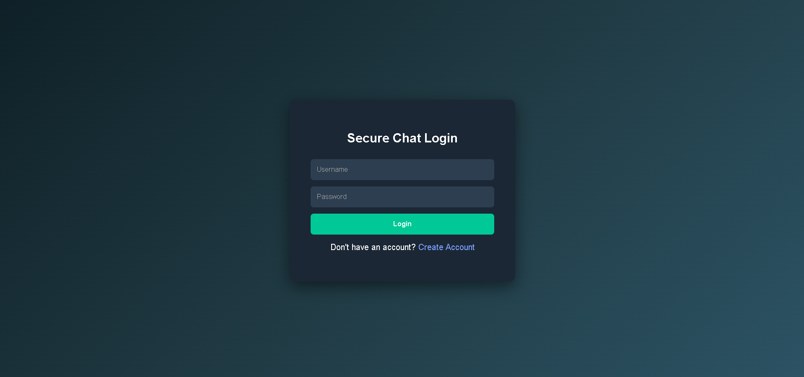
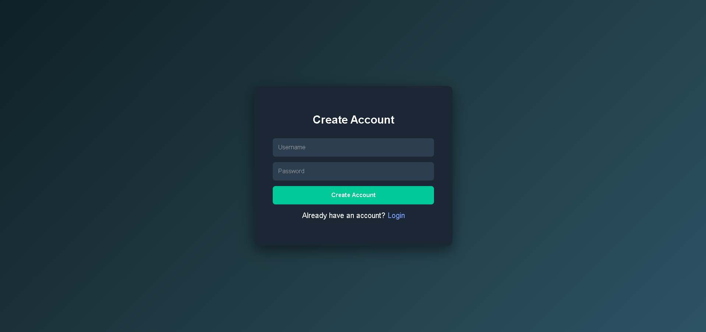
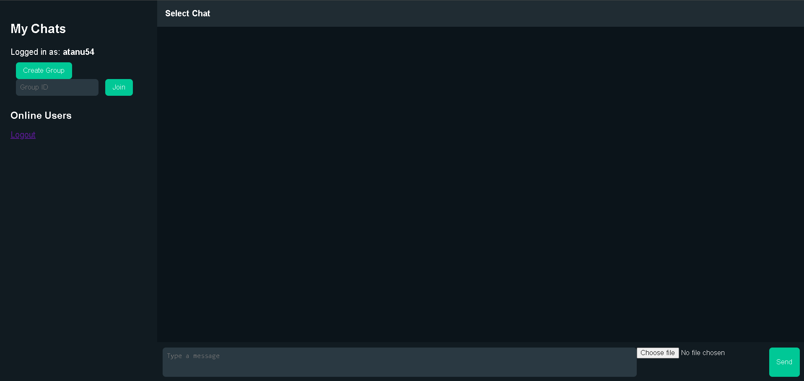

# 🔐 Secure Chat System

## 📌 Overview
A secure chat application built using Flask that allows users to communicate in real-time with a focus on privacy and security.

---

## 🚀 Features
- 💬 Real-time messaging
- 🔒 Basic secure communication
- 🖥 Clean and simple UI
- 📁 Structured backend using Flask

---

## 🛠 Tech Stack
- Python (Flask)
- HTML, CSS, JavaScript
- SQLite (local database)

---

## 📸 Screenshots
### 🔑 Login Page


### 🪧signup


### 💬 Chat Interface



---

## ▶️ How to Run Locally

```bash
git clone https://github.com/atanubanerjeegb-design/Secure-chat.git
cd Secure-chat
pip install flask
python app.py
